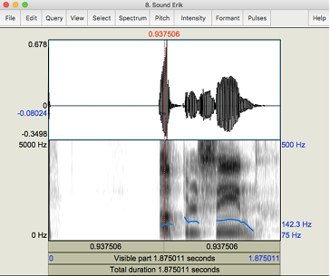
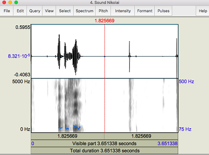
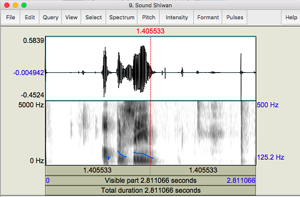

# ICA06 for gruppe 2, Dyreparken

Deltakere:

Dyb, Nikolai Holmen

Hassan, Shiwan

Krossen, Ella

Sandøy, Benjamin AG

Thompson, Sindre  

Yang, Erik

Vi har jobbet mye i samme rom og brukt en datamskin for å lage strukturen på ICAen. Dette gjorde at vi ikke har commits fra flere medlemmer.

# Exercise 1

Bildene av spektrogrammene er på slutten av exercise 1

1. Sammenligne frekvensspektrum (finn formanter) når flere personer sier et ord (for eksempel, “hjelp”). Forsøk å forklare eventuelle forskjeller i frekvensanalyse.

Vi brukte ordet appelsin, og alle opptakene var tatt på samme maskin i samme rom.

Når vi leste og sammenlignet frekvensspektrumet fant vi flere likheter og ulikheter. Shiwan og Sindre har ganske like spektrogram på grunn av dialekten deres. Shiwan har et «sortere» spektrogram enn Sindre. Vi tror at årsaken er at Shiwan snakket høyere på sitt opptak.  

Sindre har også en likhet til Nikolai. Formantene deres har lav Hz som viser til at de har mørkere stemmer. På den andre siden har vi Ella som snakker lysere, og derav får formanter med høyere Hz.

På Eriks spektrogram kan vi se at han holdt den siste stavelsen (lyd: I) lenge. Det ble tydeligere, og antageligvis lettere å gjenkjenne.

Det var noen likheter alle spektrogrammene hadde. Det hvite feltet mellom de to første formantene viser stopp i talen etter en hard konsonant (lyd: P), som vi tror er grunnen til feltet. Det er et hvitt område før den tredje formanten som også er likt på alle spektrogrammene (lyd: L ). Det er også noen «hakk» på litt tilfeldige steder på grunn av at vi trykket ned på touch-padden på datamaskinen.

2. Hvordan hadde dere gått frem for å implementere et system for gjenkjennelse av språk? For eksempel, hva skulle man klassifisere på, - enkelte lyd, hele ord eller hele setninger?

Vi tror at spektrogrammet kan være en stor del av gjenkjennelse av språk. Frekvensen viser en forskjell på uttalelsen av lyder. Vi testet og så på forskjellene på spektrogrammet til I, U og A på norsk og engelsk, og frekvensen hadde en visuell forskjell. Formantene i spektrogrammet kan også hjelpe med å identifisere lydene som er nødvendig.

Hvis programmet har en database den kan hente informasjon fra, kan den sammenligne spektrogrammene den leser med databasen. Databasen vil også være nødvendig for å kunne tolke ord. For eksempel ord som er skrevet forskjellig men lager samme lyd (SK/SKJ). Et annet eksempel kan være lunsj (norsk) og lunch (engelsk).

For et mest nøyaktig program så må det kunne forstå konteksten ut av ordene den tolker. Programmet må kunne konstruere ord fra lydene den leser. Fra konteksten kan den konstruere setninger. I tillegg så må brukeren selv gi fornuftig input for at programmet skal virke som ment.

# Bilder til exercise 1

# Exercise 2

ICA 06 har vi tatt kode fra gruppe 11. I denne koden har de brukt «main package».

Pakker

I «main package» finner vi disse importerte pakkene: Bytes, fmt, io, martini, net/http og net/URL

Bytes: en pakke som implementerer funksjoner for å manipulere byte slices.

Fmt: Implementerer funksjoner for å formatere I/O ved hjelp av utskrifts verb.

IO: Pakken gir grunnleggende grensesnitt til io-primitiv. Grensesnittet i io er hovedsakelig «Reader» og «Writer» disse to grensesnittene er til for å støtte «Read» og «Write» metoder. Det er mange funksjoner i io som bruker en av disse grensesnittene som argumenter.

Net/http: pakken inneholder implementasjon for http klient og server.

Net/URL: Pakkeadresse som analyserer nettadresser og implementerer QuerryEscaping

API: Det er der etter definert en variabel men navnet «BaseURL», denne variabelen inneholder en API til google-translate.

Funksjoner:

Func main:

Ved å skrive m := martini.classic() har de definert bokstaven m som navnet til martini.classic(). Når de da kaller på m.Get så kaller de get funksjonen til martini.

Ved martini pakken som blir brukt finner vi ut av at de bruker martiniparams, fra funksjonen finner vi ut at alt som kommer etter «speech/:» er en parameter. På linje 22 kan vi se at teksten blir hentet fra parameteren.

Linje 23: speech: gjør at alt som kommer inn i parametere tekst blir gjort om til tale, vi får også muligheten til å endre talespråk.  

I linje 25: defineres innholdstypen i URL til audio/mpeg.

I linje 27: ser vi at speech skriver til http.responswritter, deretter vil den returnere en audio. m.runOnAddr(«:8080»): Ved hjelp av denne koden kan vi definere en ønsket port.

Fra linje 33, lages det et struct(collection of fields) av type speech. Funksjonen Byte.buffer gjør at den «slicen» av data blir sendt opp til buffer, bufferen vil da være tilgjengelig fem til en ny request blir gjort.

Linje 38 til 51 har vi en funksjon som henter lyd fra google-translate. Ved hjelp av sprintf, kan vi formaterer BaseURL til tekst og språk. Dette gjøres ved å bruke queryescape(queryescape) som også kan kalles for URL encoding, data som blir overført til webapplikasjoner er nøtt til å bli «encoded», dette gjøres ved hjelp av url.QueryEscape). Vi ser at det i dette tilfelle er brukt QueryEscape til å kode text og language.

Linje 41: her sjekkes det for evt. Feil og gir tilbakemelding hvis feil.

Linje 50: Her brukes et http-get metode for å hente variabelen «req».

Linje 45 til 50: Det er en speech metode, vi bruker en if setning som sender en feilmelding til buffer hvis det er en error. Leser responsbody kopier den til buffer og sjekker deretter for feil. Hvis feil er funnet returneres det en feilmelding.

